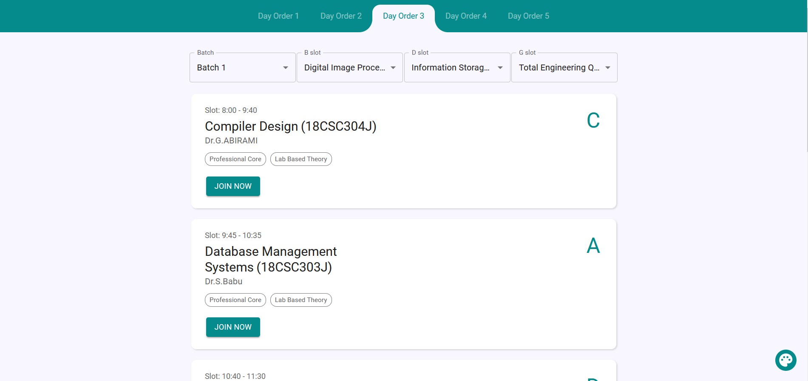
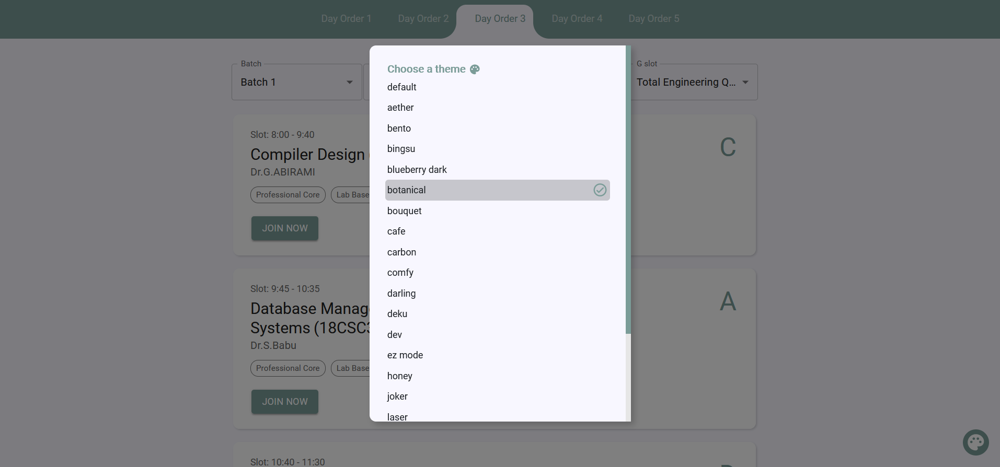

# Timetable for B1 CSE (6th Sem)

Tired of opening the Excel sheet and going to GCR for the link again and again? Here's a solution that might help in making things easier for you. Just open it and choose your batch and electives and you're all set for this semester.

<h3>Website: 
<a href="https://bit.ly/cseb1">
https://bit.ly/b1-cse
</a>
</h3>

# Common Subjects

- `Database Management Systems (A Slot)`
- `Indian Art Form (A Slot)`
- `Compiler Design (C Slot)`
- `Comprehension (D Slot)`
- `Employability Skills and Practices (E Slot)`
- `Artificial Intelligence (F Slot)`
- `Competitive Professional Skills - III (P49-P50)`

# Professional Electives (B Slot)

- `Digital Image Processing`
- `Data Mining and Analytics`
- `Wireless and Mobile Communications`
- `Network Security`

# Professional Electives (D Slot)

- `Information Storage and Management`
- `Neuro Fuzzy and Genetic Programming`
- `Wireless Sensor Networks`

# Open Electives (G Slot)

- `Total Engineering Quality Management`
- `B2B Marketing`
- `Data X - Applied Data Science with Venture Application`
- `Animal Models for Research`
- `Process Plant Safety`
- `Operations Research`

# Demo

### `New Themes`

Inspired by <a href="https://monkeytype.com/">
MonkeyType
</a>

# Can't find your electives?

- Get in touch. <a href="mailto:m.muazam.99@gmail.com">`Click here`</a> 
- Contribute now by adding your electives <a href="https://github.com/mmuazam98/mytimetable2.0/tree/main/src/timetable">`here`</a>

##

Leave a ⭐ if you like it.

